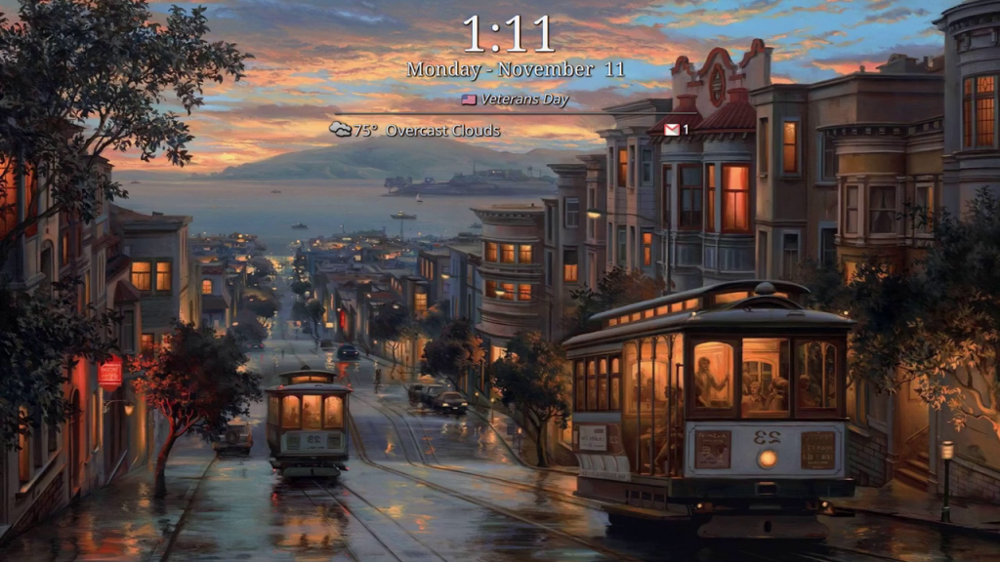

# Customizing KDE Plasma Desktop

## [My Plasma setup](https://txhammer68.github.io/docs/kde/slideshow.html)

## [Custom Lockscreen for KDE plasma](https://github.com/txhammer68/Lockscreen#custom-plasma-lockscreen)

* Clock remove am/pm
* Calendar,weather,email info

## [Plasma Widgets](https://github.com/txhammer68/qml)
### System monitor dashboard

### Web Search

### System menu

## [Plasma Look And Feel Explorer](https://userbase.kde.org/Plasma/Create_a_Look_and_Feel_Package)
  Plasma Look And Feel Explorer is a KDE application that allows you to create your own desktop theme.
  The 'Plasma Look and Feel Explorer' is part of the 'plasma-sdk', install it from your distro repo.
  the advatage of creating your own LnF theme is that you can change things like the lockscreen,logout, 
  and other compenents that are part of the default Breeze LnF theme...Most Lnf themes rely on the Breeze Lnf compenents 
  for their theme. Creating your own theme will allow you to custimize every compenent of the Plasma desktop to your liking.
  Once you create your own theme copy the folders from /usr/share/plasma/look-and-feel/org.kde.breeze.desktop/contents/ 
  to your theme in /home/.local/share/plasma/look-and-feel/"your theme name"/
 
  

## [Kvantum](https://github.com/tsujan/Kvantum/tree/master/Kvantum) 
Kvantum is widget customizer for KDE, widgets are the controls and drop down menus within Plasma

## Ideas for Plasma
* Incorporate Google type notifications into Plasma notifications, sports,news,stocks
  * Using Node JS to get info and notify timer events
* Wallpaper slideshow to use picture metadata exif info to show location/description of photo on wallpaper

