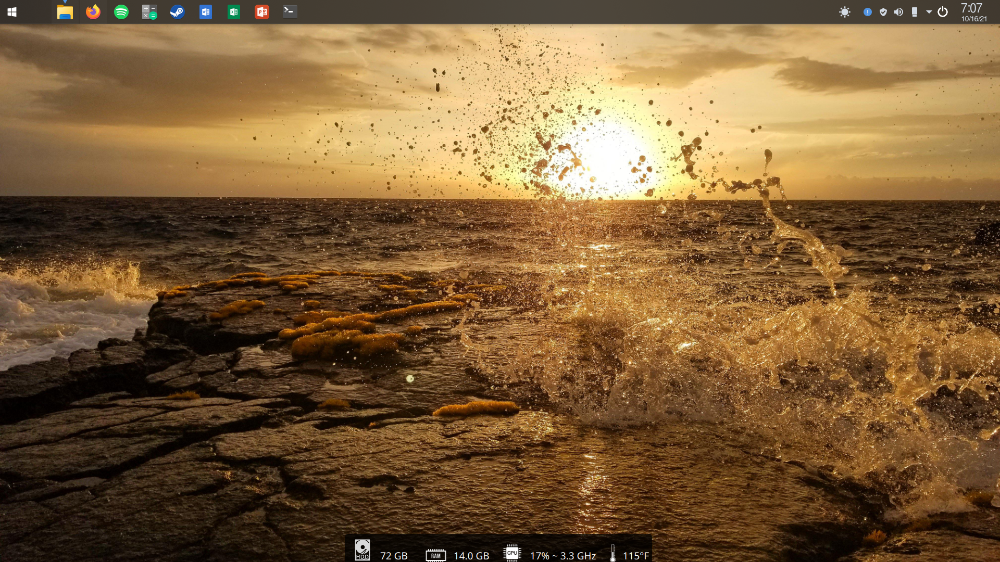
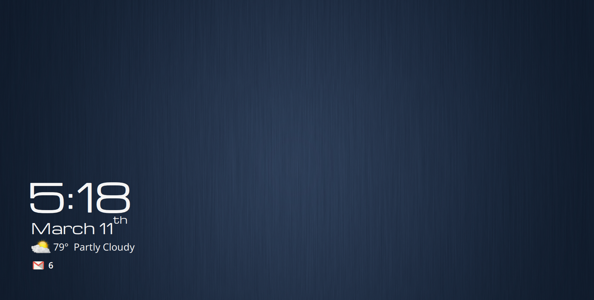
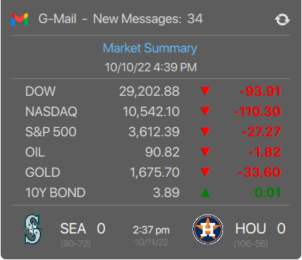
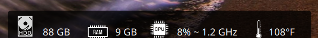
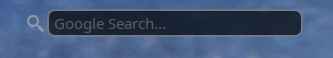
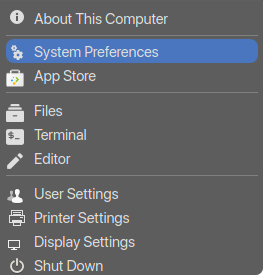
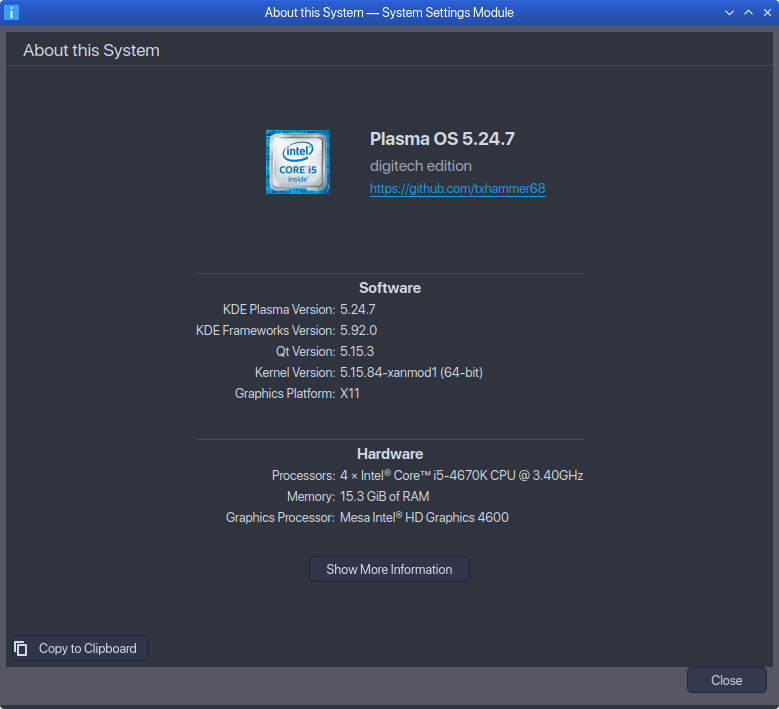

### Customizing KDE Plasma Desktop
### [Optimizing Kubuntu](kubuntu.md)<br>

<picture>
  
</picture>
<br>

### My Plasma setup
<br>

<iframe src="https://drive.google.com/file/d/1a4Uj2vjnFvA0DLU8SnNhjEWTQOfJIRUa/preview" width="740" height="560" allow="autoplay"></iframe>

<video src="https://drive.google.com/uc?export=download&id=1a4Uj2vjnFvA0DLU8SnNhjEWTQOfJIRUa" controls="controls" style="max-width: 730px;">
</video>

<br>

<picture>
  
</picture>
<br>

### [Custom Lockscreen](lockscreen.md) <br>
* Display current weather conditions,calendar events <br>

### [Plasma Widgets](https://github.com/txhammer68/qml#misc-kde-5-plasma-qml-widgets)

### G-mail/Stocks/Sports stacked widget
[](https://raw.githubusercontent.com/txhammer68/qml/master/G-Mail.zip)

### Weather Widget
[](https://raw.githubusercontent.com/txhammer68/qml/master/DarkSky.zip)

### System monitor dashboard
[](https://raw.githubusercontent.com/txhammer68/qml/master/SystemDashboard.zip)

### Web Search
[](https://raw.githubusercontent.com/txhammer68/qml/master/org.kde.search.zip)

### System menu
[](https://raw.githubusercontent.com/txhammer68/qml/master/system-menu.zip)

### Web Apps
* Create web app shortcuts for your favorite web apps, spotify,netflix,gmail,etc...
* Using chrome or firefox and xprop to determine window class info
* Cleaner look  - no toolbars or url location
* create a desktop entry in $HOME/.local/share/applications/
* to have it use its own icon instead of the web browser icon use xprop to determine window class
* run the desktop entry created and then in in terminal run xprop and click the window title
* Notice the entry for StartupWMClass
* Paste this into the desktop entry
```
[Desktop Entry]
Comment=G-Mail Web App
Exec=/opt/google/chrome/google-chrome --disk-cache-dir=/tmp/cache --profile-directory=Default --app=https://mail.google.com/mail/u/0/#inbox
GenericName=G-Mail Web App
Icon=$HOME/Pictures/Misc/icons/email.png
MimeType=
Name=G-Mail
NoDisplay=false
StartupNotify=true
StartupWMClass=mail.google.com__mail_u_0
Terminal=false
Type=Application
Version=1.0
```
### Customize System Info
<picture>
  
</picture>
<br>

* Create a new file kcm-about-distrorc within $HOME/.config/
```
[General]
Name=Plasma OS
LogoPath=$HOME/Pictures/Misc/icons/ai_48.png
Website=https://github.com/txhammer68
Version=5.24
Variant=kubuntu edition
```

### [Plasma Look And Feel Explorer](https://userbase.kde.org/Plasma/Create_a_Look_and_Feel_Package)
  Plasma Look And Feel Explorer is a KDE application that allows you to create your own desktop theme.
  The 'Plasma Look and Feel Explorer' is part of the 'plasma-sdk', install it from your distro repo.
  the advatage of creating your own LnF theme is that you can change things like the lockscreen,logout, 
  and other compenents that are part of the default Breeze LnF theme...Most Lnf themes rely on the Breeze Lnf compenents 
  for their theme. Creating your own theme will allow you to custimize every compenent of the Plasma desktop to your liking.
  Once you create your own theme copy the folders from /usr/share/plasma/look-and-feel/org.kde.breeze.desktop/contents/ 
  to your theme in /home/.local/share/plasma/look-and-feel/"your theme name"/
 
  


### [Kvantum](https://github.com/tsujan/Kvantum/tree/master/Kvantum) 
* Kvantum is widget customizer for KDE, widgets are the controls and drop down menus within Plasma
* [Kvantum themes](https://store.kde.org/browse/cat/123/order/latest/) 


### [KDE Store](https://store.kde.org/browse/cat/) 
* Central place to get custom themes for KDE Plasma

<picture>
  
</picture>

[TxHammer68](https://github.com/txhammer68)

### Notes for Desktop Setup
* Icons - Papirus
* Copy LnF Breeze Theme to MyBreeze
  * For changing Lockscreen/Logout
  * Copy Lockscreen/Logout to new theme folder
  * Change Global theme to MyBreeze
* Application Style - kvantum / Arc
* Plasma Style - Fluent Round Dark
* Colors - Arc
* Fonts - SF Pro Display
* Window Decorations  - Breeze
* Cursors - Breeze Light
* SDDM - MyBreeze
<br>
