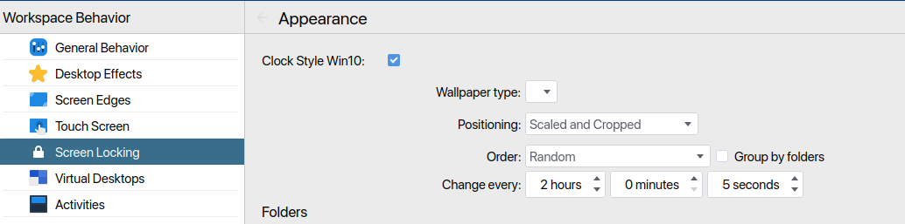

## Lockscreen for KDE Plasma 5

### Win 10 Lockscreen  
<picture>
  
</picture>
 

### Hub Info Lockscreen  

 

### Lockscreen Settings  
<picture>
  
</picture>  
 

Download [MyBreeze.zip](https://github.com/txhammer68/plasma-Lockscreen-nest-hub/blob/master/MyBreeze.zip) to test usage 
Or create your own theme and use Clock10.qml or ClockHub.qml to replace the standard Clock.qml in the Breeze LnF theme. 

* Lockscreen
    * Select Clock Style
    * System Settings - >Workspace Behavior - >Screen Locking ->Appearance ->Clock Style Config
    * Win 10 or Hub Style
    * Win 10 / Lower left side of display
        * Clock10.qml within components folder
        * Current time / date
        * Calendar Events
        * Current weather conditions
    * Hub Style / Centered top of display
        * ClockHub.qml
        * Current time / date
        * Calendar events
        * Current weather conditions
        * G-mail new messages
        * Weather forecast
        * NYSE Market indexes
        * Favorite sports team scores  

## Config for lockscreen data
* NYSE market data from yahoo.finance.com
* Sports data from espn.com
* Weather data from dark sky
* G-Mail unread messages count

#### GetData.qml library functions to retrieve data from internet
* Edit this file for weather, market data, sports teams, gmail

### G-Mail python is required to access your mailbox data
* Install python3 for your system / already installed most linux distros  
`python3 --version`  
`pip install --upgrade google-api-python-client`  
* Must setup google OAuth to allow access to gmail mailbox
* [Gmail Oauth](https://developers.google.com/gmail/api/quickstart/python)  
* [Google APIs Client Library for Python](https://googleapis.github.io/google-api-python-client/docs/)  
* [Sample script to get unred messages](https://github.com/akora/gmail-message-counter-python)  
* Change to write output to file read by Clock10.qml / ClockHub.qml

### Calendar Events
* Events.qml within components folder
* Edit to add / change events for your needs

### Weather Info
* [Obtain key for Open Weather API](https://openweathermap.org/api)  
* Use systemd timer to update weather with curl
* Write json data to to local file, used in lockscreen Clock10.qml / ClockHub.qml
